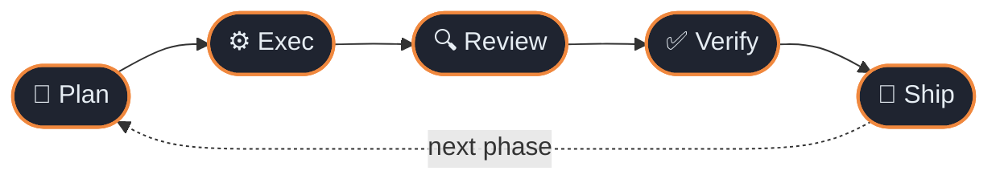
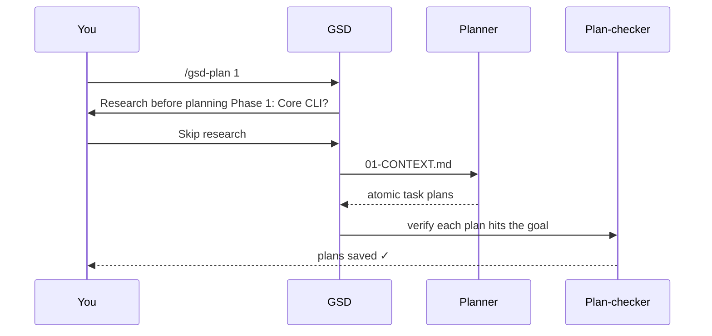

# 🚀 Your First Project with GSD Core Nexus 2.5

A complete, step-by-step walkthrough: taking a simple to-do CLI from idea to
shipped code using GSD's canonical loop.

> **Target audience:** developers new to GSD Core Nexus.  
> **Prerequisites:** a supported runtime installed and connected (Claude Code, Antigravity, Cursor, etc.).  
> **Time to complete:** ~15–20 minutes.

---

## 🎯 What we're building

A lightweight Node.js to-do CLI with four operations:
- `node todo.js add "buy milk"`
- `node todo.js list`
- `node todo.js done <id>`
- `node todo.js list --all`

---

## 🔁 The Core Loop

Every phase in GSD follows the canonical **5-step loop**:



| Step | Command | In one sentence | Typical time |
|:----:|---------|-----------------|:------------:|
| 📐 **Plan** | `/gsd-plan [N]` | GSD gathers preferences, UI specs, research, and creates atomic plans. | 1–4 min |
| ⚙️ **Exec** | `/gsd-exec [N]` | Fresh agents write code in parallel waves and commit each task. | 2–5 min |
| 🔍 **Review** | `/gsd-review --fix` | Static analysis and auto-repairs against anti-patterns. | <1 min |
| ✅ **Verify** | `/gsd-verify [N]` | GSD walks you through conversational UAT against acceptance criteria. | 1–3 min |
| 🚀 **Ship** | `/gsd-ship` | Pull request is prepared and release tags created. | <1 min |

---

## Step 1 — Initialize Workspace

```bash
mkdir todo-cli
cd todo-cli
git init
```

Check the initial situational state:

```text
/gsd-status
```

GSD inspects the directory, detects an uninitialized workspace, and prepares the planning scaffolding.

---

## Step 2 — Plan Phase 1

```text
/gsd-plan 1
```



GSD gathers your implementation preferences, turns them into `01-CONTEXT.md`, and spawns the planner to produce atomic task plans in `.planning/phases/01-core-cli/`:
- `01-01-PLAN.md` (read/write helpers)
- `01-02-PLAN.md` (add / list / done commands)

---

## Step 3 — Execute Phase 1

```text
/gsd-exec 1
```

GSD organizes plans into parallel waves, executes tasks in clean context windows, and commits progress atomically:

```text
Wave 1 (parallel):
  [Executor A] → 01-01-PLAN.md (read/write helpers)   ✓ committed
  [Executor B] → 01-02-PLAN.md (CLI commands)          ✓ committed

[Verifier] Checking codebase against phase goals...
  Status: PASS
```

Test your new CLI:

```bash
node todo.js add "buy milk"
node todo.js add "write tests"
node todo.js list        # → shows both items
node todo.js done 1
node todo.js list        # → shows only "write tests"
```

---

## Step 4 — Review Code

```text
/gsd-review --fix
```

Runs static analysis over all modified files, checking against established anti-patterns and applying automated fixes.

---

## Step 5 — Verify the Work

```text
/gsd-verify 1
```

GSD presents interactive UAT checkpoints based on phase success criteria:

```text
╔══════════════════════════════════════════════════════════════╗
║  CHECKPOINT: Verification Required                           ║
╚══════════════════════════════════════════════════════════════╝

**Test 1: Add a to-do**
Running `node todo.js add "buy milk"` creates a pending item without errors.

──────────────────────────────────────────────────────────────
Type `pass` or describe what's wrong.
──────────────────────────────────────────────────────────────
```

Type `pass` to confirm the behavior. GSD saves the results in `01-UAT.md`.

---

## Step 6 — Check Telemetry & Ship

Check context savings and token efficiency:

```text
/gsd-tokens
```

And ship the verified phase:

```text
/gsd-ship 1
```

GSD opens the Pull Request with complete verification evidence, requirements traceability, and release notes! 🚀

---

## 🛟 Troubleshooting & Quick Reference

| Issue | Solution |
|---|---|
| Command not found | Ensure GSD 2.5 installer has run for your active runtime |
| Lost track of progress | Run `/gsd-status` to inspect current state and next actions |
| Broken code after execution | Run `/gsd-review --fix` or inspect `VERIFICATION.md` |
| Multi-phase project | Repeat `/gsd-plan [N]` → `/gsd-exec [N]` → `/gsd-verify [N]` |
